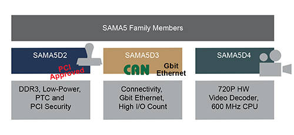

# [SAMA5](https://github.com/sochub/SAMA5)

 

#### 厂商：[microchip](https://github.com/sochub/microchip) 
#### 架构：[cortex A5](https://github.com/sochub/CA5)

### [SAMA5描述](https://github.com/sochub/SAMA5/wiki) 

The SAMA5 series are high-performance, ultra-low power ARM Cortex-A5 core based MPU devices. They support multiple memories, including DDR3, LPDDR3, and QSPI Flash.  A rich set of peripherals, user interfaces, and robust security features simplify the design for control panels/HMI, secure IoT gateways, connectivity, barcode scanners, printers and POS terminal applications.  The low-power features and small packages are ideal for wearables and other battery-operated consumer devices.  A wide range of third-party offerings complements our development kits and software support.

### [资源组成](https://github.com/sochub/SAMA5)

* [文档](docs/) 
* [资源](src/) 

###  [SoC资源平台](http://www.qitas.cn)
